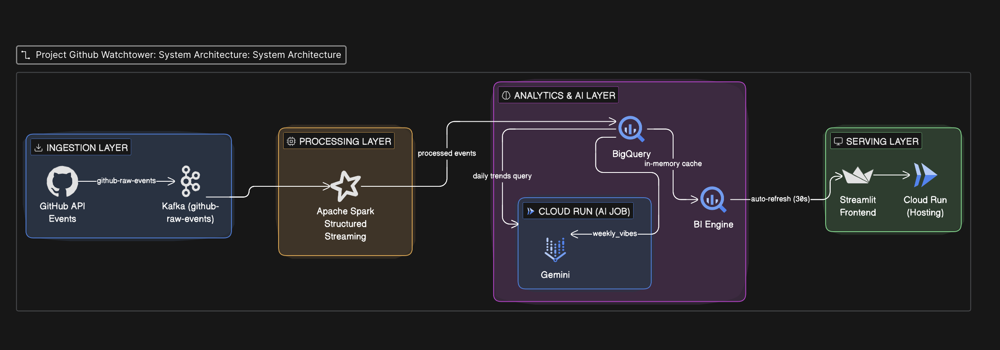
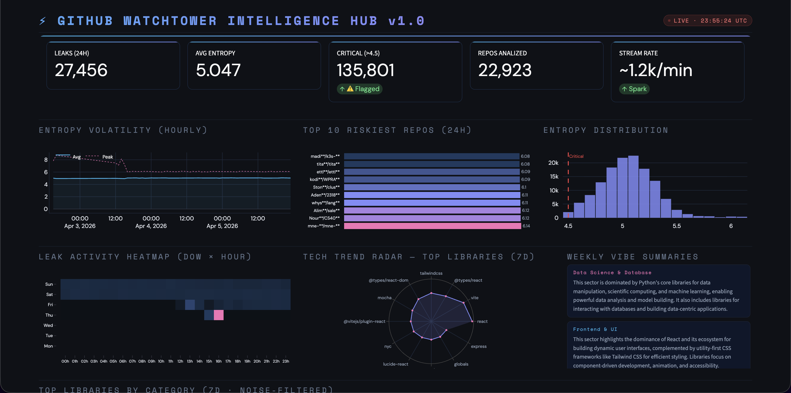
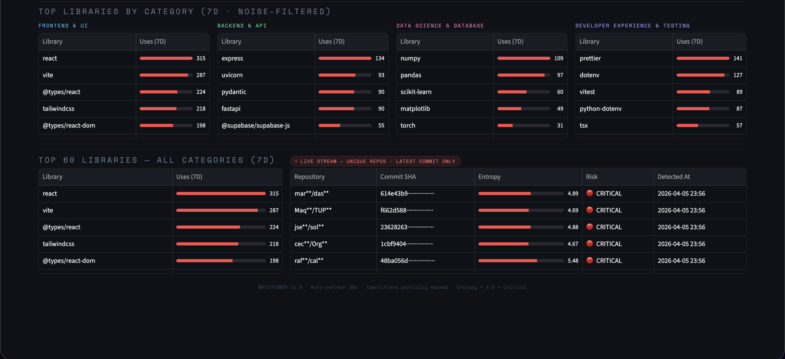

# 🛡️ GitHub Watchtower Intelligence Hub

Watchtower Intelligence Hub is a real-time data streaming and analytics pipeline designed to monitor public GitHub push events. The platform serves two primary purposes:

1. **Security Monitoring (Leak Detection):** Scans commit patches for high-entropy strings indicating potential accidental secret exposure (e.g., API keys, passwords, tokens).

<div align="center">
  
</div>

1. **Tech Trend Pulse:** Dynamically tracks emerging open-source technologies by extracting library dependencies from `package.json` and `requirements.txt` files.

The system is highly scalable, processing events through a Kafka-Spark pipeline into Google BigQuery, where it is visualized on a dynamic Streamlit Dashboard. Furthermore, it leverages Google Vertex AI (Gemini) to perform "Vibe Checks," offering LLM-powered context and sentiment analysis of emerging tech trends.

---

## 🏗️ Architecture Overview

<div align="center">
  
</div>

The platform consists of several decoupled, microservice-like components:

### 1. 📡 Ingestor (`/data_processing` & `ingestor-job.py`)

- Python scripts polling the public GitHub Events API (`/events`).
- Filters for `PushEvent` and extracts repository names and commit SHAs.
- Produces events to a secure Confluent **Kafka** topic (`github-raw-events`).

### 2. ⚡ Processing Engine (`/data_processing/processor.py`)

- A **PySpark** Structured Streaming application.
- Consumes the `github-raw-events` Kafka stream.
- Fetches the actual commit patch via the GitHub REST API.
- **Multipurpose Analysis:**
  - **Leaks:** Calculates Shannon Entropy per string. High entropy strings (>4.5) are flagged and saved as potential leaks.
  - **Trends:** Uses Regex to extract Node.js and Python dependencies being pushed live.
- Sinks the processed, structured data into **Google BigQuery**.

### 3. 🤔 LLM Vibe Check (`/LLM/main.py`)

- A scheduled Python job that queries BigQuery for the top 300 trending libraries in the last 24 hours.
- Feeds the library list into **Vertex AI (Gemini 2.5 Flash Lite)**.
- Gemini categorizes the trends into sectors (e.g., Frontend & UI, Backend & API, etc.) and generates a short summary/vibe description.
- The insight report is written back to the BigQuery `weekly_vibes` table.

### 4. 📊 Dashboard (`/dashboard/app.py`)

- The terminal node of the pipeline. A sleek, terminal-aesthetic **Streamlit** dashboard.
- Displays key KPIs (Total Leaks, Avg Risk), Entropy Volatility metrics, Heatmaps for leak activity, and Radar charts for trend adoption.
- Live stream component updates continuously, featuring the most critically flagged commits.
- Presents LLM-backed insights in real-time.

<div align="center">
  
</div>

<div align="center">
  
</div>

---

## 🗄️ Database Schema

Located in `infra/bq_schema.sql`, the **BigQuery** Data Warehouse (`watchtower_db`) includes:

- `tech_trends`: Raw library extractions.
- `detected_leaks`: Stores entropy scores, commit SHAs, and repo details.
- `weekly_vibes`: Stores Gemini's sector-based tech summaries.
- `v_public_security_stream`: A view ensuring compliance and security by masking repository names and commit hashes for dashboard usage.

---

## 🚀 Getting Started

### Prerequisites

- Python 3.9+
- Apache Spark (for PySpark execution)
- A Kafka Cluster (e.g., Confluent Cloud)
- Google Cloud Platform (GCP) project with BigQuery & Vertex AI API enabled.
- GitHub Personal Access Token.

### Environment Setup

1. Define the following environment variables:

   ```bash
   export GITHUB_TOKEN="your_github_pat"
   export KAFKA_SERVER="your_kafka_broker:9092"
   export KAFKA_KEY="your_kafka_api_key"
   export KAFKA_SECRET="your_kafka_api_secret"
   ```

2. Setup the BigQuery tables using `infra/bq_schema.sql` in your GCP project.
3. Authenticate with GCP locally: `gcloud auth application-default login`

### Running the Services

Start the components in the following order:

1. **Stream Processing (PySpark)**

   ```bash
   cd data_processing
   spark-submit --packages org.apache.spark:spark-sql-kafka-0-10_2.12:3.5.0 \
   --conf "spark.app.github_token=$GITHUB_TOKEN" \
   --conf "spark.app.kafka_server=$KAFKA_SERVER" \
   --conf "spark.app.kafka_key=$KAFKA_KEY" \
   --conf "spark.app.kafka_secret=$KAFKA_SECRET" \
   processor.py
   ```

2. **Ingestor Job**

   ```bash
   cd data_processing
   python ingestor.py
   ```

3. **Dashboard**

   ```bash
   cd dashboard
   streamlit run app.py
   ```

4. **LLM Trend Analysis (Batch)**

   ```bash
   cd LLM
   python main.py
   ```

## 📜 License

This project is for demonstration and security awareness purposes.
